**English** | [简体中文](README.zh-CN.md)

<picture>
  <source media="(max-width: 640px) and (prefers-color-scheme: dark)" srcset="assets/presentation/hero-mobile-dark.svg">
  <source media="(max-width: 640px)" srcset="assets/presentation/hero-mobile-light.svg">
  <source media="(prefers-color-scheme: dark)" srcset="assets/presentation/hero-dark.svg">
  
</picture>

**Compare quant tiers, context memory and VRAM budgets under an embedded K3 model profile.**

`v0.1.0` · `Go 1.24+` · [MIT](LICENSE)

[Website](https://k3fit.lei6393.com) · [Demo record](docs/demo-results.json)

## Why use it

Before downloading and deploying large weights, explicit model assumptions can support a preliminary memory account. K3Fit separates fixed state, per-token KV, active experts and quant coefficients to produce estimates per tier. Its constants are marked schema-unverified in source and must be checked against the actual model.

## Architecture

<picture>
  <source media="(max-width: 640px) and (prefers-color-scheme: dark)" srcset="assets/presentation/architecture-mobile-dark.svg">
  <source media="(max-width: 640px)" srcset="assets/presentation/architecture-mobile-light.svg">
  <source media="(prefers-color-scheme: dark)" srcset="assets/presentation/architecture-dark.svg">
  
</picture>

model computes fixed-state and KV memory; quant supplies bits-per-weight values. fit subtracts active weights and fixed state from VRAM to derive a maximum context. tps divides a fixed 240 GB/s constant by active weights. Reports retain per-tier estimates without running inference.

Assumptions are in [spec.go](internal/model/spec.go), with formulas in [delta_attention.go](internal/model/delta_attention.go) and [planner.go](internal/fit/planner.go). --ram is currently retained for reporting and is not enforced by the fit solver.

## Install

Requires Go 1.24+. The calculation needs no GPU, model file or model service.

```bash
git clone https://github.com/SuperMarioYL/k3fit.git
cd k3fit
go build -o k3fit ./cmd/k3fit
```

## Quickstart

Two explicit budget scenarios run the real CLI and exercise its formulas. They do not verify official K3 specifications, run a model or measure throughput; ratios and ranges are calculations under the embedded assumptions.

```bash
go run ./cmd/k3fit --vram 32 --ram 128
go run ./cmd/k3fit --vram 96 --ram 256 --quant Q3_K_M
```

All inputs are command-line budgets, retained in [examples/presentation_demo.sh](examples/presentation_demo.sh). The profile test snapshot is [testdata/k3spec_golden.json](testdata/k3spec_golden.json).

## Usage

--vram and --ram are required GiB values. --quant restricts a tier and --ctx selects a context to inspect in the report. By default, all quant tiers are considered and recommendation prioritizes maximum context, not model quality.

## Recorded demo

<picture>
  <source media="(max-width: 640px) and (prefers-color-scheme: dark)" srcset="assets/presentation/process-mobile-dark.svg">
  <source media="(max-width: 640px)" srcset="assets/presentation/process-mobile-light.svg">
  <source media="(prefers-color-scheme: dark)" srcset="assets/presentation/process-dark.svg">
  
</picture>

### Enumerate quant tiers

Calculate per-tier results under a 32 GiB VRAM budget.

```text
$ go run ./cmd/k3fit --vram 32 --ram 128

K3Fit — Kimi K3 Delta-Attention Fit Planner
══════════════════════════════════════════════════════════
Rig:  32 GiB VRAM | 128 GiB RAM
Model: Kimi K3 — 3T params, MoE 896×16, 93 layers (69 Delta-Attention + 24 KV)

Delta-Attention memory at 1M context
+--------------------------------------------------+-------+------------------------------------------+
|                    COMPONENT                     |  GIB  |                  NOTES                   |
+--------------------------------------------------+-------+------------------------------------------+
| DA matrix (69 layers × 2 heads × 128×128 × fp16) |  0.00 | 128×128 matrix/head, context-independent |
| KV cache (24 layers × 1M tokens)                 | 22.89 | standard per-token KV cache              |
| Total (Delta-Attention)                          | 22.89 | at 1M ctx                                |
| (Standard KV — all 93 layers)                    | 88.69 | what generic profilers compute           |
+--------------------------------------------------+-------+------------------------------------------+
Delta-Attention saves 3.9× vs standard KV-cache at 1M context.

Quant fit analysis (VRAM = 32 GiB)
+--------+-------+-------------+---------+---------+-------+
| QUANT  |  BPW  | WEIGHTS GIB | MAX CTX | STD CTX | FITS? |
+--------+-------+-------------+---------+---------+-------+
| Q2_K   |  2.56 |       835.3 |  589837 |    512K |  yes  |
| Q3_K_S |  2.75 |       896.4 |  530709 |    512K |  yes  |
| Q3_K_M |  3.27 |      1065.9 |  366728 |    256K |  yes  |
| Q4_K_S |  3.50 |      1140.9 |  294198 |    256K |  yes  |
| Q4_K_M |  4.25 |      1385.3 |   57687 |     32K |  yes  |
| Q5_K_S |  5.00 |      1629.8 |       — |       — |  no   |
| Q5_K_M |  5.25 |      1711.3 |       — |       — |  no   |
| Q6_K   |  6.10 |      1988.4 |       — |       — |  no   |
| Q8_0   |  8.00 |      2607.7 |       — |       — |  no   |
| F16    | 16.00 |      5215.4 |       — |       — |  no   |
+--------+-------+-------------+---------+---------+-------+
Weights GiB = total model on disk (mmap). Max Ctx = VRAM-resident ceiling.

──────────────────────────────────────────────────────────
Recommendation: Q2_K at 512K context
Expert routing:  16 of 896 experts active per token (1.8% activation)
Predicted decoding tps ≈ 12 (heuristic, ±30% → 8–16)
Disk required:  ~835 GiB (Q2_K GGUF)
VRAM at 512K:      30.5 GiB (weights 18.5 + ctx 12.0) / 32 GiB budget
1M context:      does NOT fit at any quant — max is 589837 tokens (576K) at Q2_K
```

### Constrain the quant tier

Recalculate for 96 GiB VRAM and Q3_K_M.

```text
$ go run ./cmd/k3fit --vram 96 --ram 256 --quant Q3_K_M

K3Fit — Kimi K3 Delta-Attention Fit Planner
══════════════════════════════════════════════════════════
Rig:  96 GiB VRAM | 256 GiB RAM
Model: Kimi K3 — 3T params, MoE 896×16, 93 layers (69 Delta-Attention + 24 KV)

Delta-Attention memory at 1M context
+--------------------------------------------------+-------+------------------------------------------+
|                    COMPONENT                     |  GIB  |                  NOTES                   |
+--------------------------------------------------+-------+------------------------------------------+
| DA matrix (69 layers × 2 heads × 128×128 × fp16) |  0.00 | 128×128 matrix/head, context-independent |
| KV cache (24 layers × 1M tokens)                 | 22.89 | standard per-token KV cache              |
| Total (Delta-Attention)                          | 22.89 | at 1M ctx                                |
| (Standard KV — all 93 layers)                    | 88.69 | what generic profilers compute           |
+--------------------------------------------------+-------+------------------------------------------+
Delta-Attention saves 3.9× vs standard KV-cache at 1M context.

Quant fit analysis (VRAM = 96 GiB)
+--------+------+-------------+---------+---------+-------+
| QUANT  | BPW  | WEIGHTS GIB | MAX CTX | STD CTX | FITS? |
+--------+------+-------------+---------+---------+-------+
| Q3_K_M | 3.27 |      1065.9 | 1000000 |      1M |  yes  |
+--------+------+-------------+---------+---------+-------+
Weights GiB = total model on disk (mmap). Max Ctx = VRAM-resident ceiling.

──────────────────────────────────────────────────────────
Recommendation: Q3_K_M at 1M context
Expert routing:  16 of 896 experts active per token (1.8% activation)
Predicted decoding tps ≈ 9 (heuristic, ±30% → 7–12)
Disk required:  ~1066 GiB (Q3_K_M GGUF)
VRAM at 1M:      46.5 GiB (weights 23.6 + ctx 22.9) / 96 GiB budget
1M context:      fits at Q3_K_M
```

## Capabilities and integration

<picture>
  <source media="(max-width: 640px) and (prefers-color-scheme: dark)" srcset="assets/presentation/integrations-mobile-dark.svg">
  <source media="(max-width: 640px)" srcset="assets/presentation/integrations-mobile-light.svg">
  <source media="(prefers-color-scheme: dark)" srcset="assets/presentation/integrations-dark.svg">
  
</picture>

K3Fit is an inspectable calculator. It does not read GGUF metadata, probe actual hardware or execute inference. Check model specifications, full residency needs and runtime overhead before relying on a deployment decision.


## Configuration

Quant coefficients are in internal/quant/table.go, model constants in internal/model/spec.go and bandwidth in internal/tps/estimate.go. The displayed ±30% range is a fixed proportional band, not an empirical confidence interval. There is no implemented --emit-config or topology option.

## Roadmap and scope

Arithmetic memory accounting, quant enumeration, context checks and heuristic throughput estimates are implemented. Device calibration, launch-config export, multi-GPU topology and other model profiles remain future work.

- Embedded model constants are explicitly schema-unverified, not confirmed official specifications.
- RAM is not enforced by the fit constraint, and throughput does not use measured device bandwidth.
- These outputs are not measured performance or a guarantee of successful deployment.

[Terminal recording](assets/demo.gif) · [Recording script](docs/demo.tape)

## License

[MIT](LICENSE)
