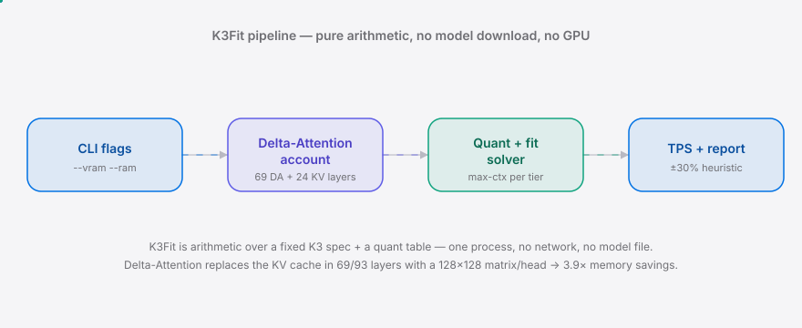
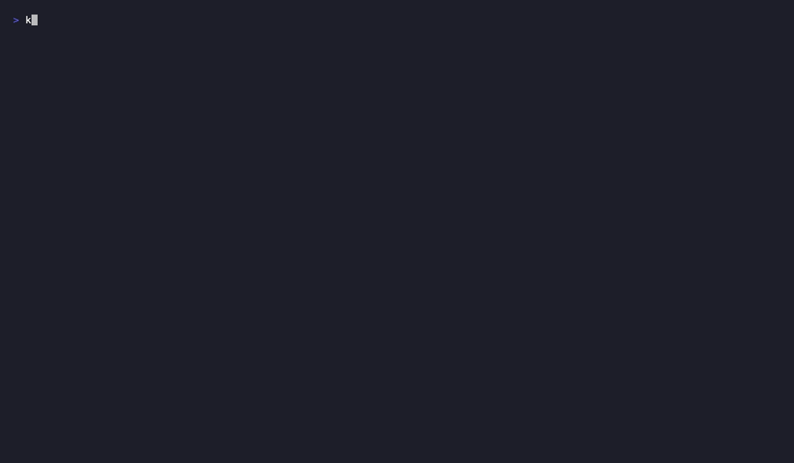

<div align="right"><sub><b>EN</b>&nbsp;&nbsp;⇄&nbsp;&nbsp;<a href="./README.zh-CN.md">中文</a></sub></div>

<picture>
  <source media="(prefers-color-scheme: dark)" srcset="./assets/hero-dark.svg">
  <source media="(prefers-color-scheme: light)" srcset="./assets/hero-light.svg">
  
</picture>

<p align="center"><sub>K3Fit is the Go CLI that sizes <b>Kimi K3</b> for your rig before downloading 1.4&nbsp;TB.</sub></p>

<p align="center">
  <a href="./LICENSE"></a>
  <a href="https://github.com/SuperMarioYL/k3fit/releases"></a>
  
  
  
</p>

**Don't download 1.4&nbsp;TB of Kimi K3 until you run this one command.**

K3Fit is a one-command Go CLI that uses Kimi K3's Delta-Attention memory model to pick your max-context, GGUF quant, and expert-routing — and reports a predicted tps before you commit to a 1.4&nbsp;TB download, so your Agent workflows and homelab rigs are sized correctly the first time.

<h2> Architecture</h2>

<picture>
  <source media="(prefers-color-scheme: dark)" srcset="./assets/atlas-dark.svg">
  <source media="(prefers-color-scheme: light)" srcset="./assets/atlas-light.svg">
  
</picture>

K3Fit is pure arithmetic over a fixed K3 architecture spec + a GGUF quant table — one process, no network, no model file. The core primitive is the **Delta-Attention memory account**: 69 of 93 layers replace the per-token KV cache with a fixed 128×128 state matrix per head, so a 1M-context memory profile is 3.9× smaller than what generic KV-cache profilers compute.

<h2> Install & Quickstart</h2>

```bash
go install github.com/SuperMarioYL/k3fit/cmd/k3fit@latest
k3fit --vram 32 --ram 128
```

Or build from source:

```bash
git clone https://github.com/SuperMarioYL/k3fit.git
cd k3fit && go build -o k3fit ./cmd/k3fit
./k3fit --vram 32 --ram 128
```

<details><summary>sample output</summary>

```
K3Fit — Kimi K3 Delta-Attention Fit Planner
══════════════════════════════════════════════════════════
Rig:  32 GiB VRAM | 128 GiB RAM
Model: Kimi K3 — 2.8T params, MoE 896×16, 93 layers (69 Delta-Attention + 24 KV)

Delta-Attention memory at 1M context
  DA matrix (69 layers)     0.00 GiB  fixed
  KV cache (24 layers)    22.89 GiB  per-ctx
  Total (Delta-Attention) 22.89 GiB
  (Standard KV all 93)   88.69 GiB  — what generic profilers compute
  Delta-Attention saves 3.9× at 1M context.

──────────────────────────────────────────────────────────
Recommendation: Q2_K at 512K context
Expert routing:  16 of 896 experts active per token (1.8% activation)
Predicted decoding tps ≈ 12 (heuristic, ±30% → 8–16)
Disk required:  ~835 GiB (Q2_K GGUF)
VRAM at 512K:  30.5 GiB / 32 GiB budget
1M context:  does NOT fit at any quant — max is 589837 tokens (576K) at Q2_K
```

</details>

<h2> Usage</h2>

```bash
# Full fit + quant + routing + predicted tps
k3fit --vram 32 --ram 128

# Constrain to a specific quant tier
k3fit --vram 96 --ram 256 --quant Q3_K_M

# Check a specific context size
k3fit --vram 32 --ram 128 --ctx 512000
```

| Flag | Type | Default | Meaning |
|---|---|---|---|
| `--vram` (`-v`) | GiB | required | VRAM budget |
| `--ram` (`-r`) | GiB | required | System RAM budget (mmap working set) |
| `--quant` (`-q`) | string | all tiers | Constrain to one GGUF quant (e.g. `Q2_K`, `Q3_K_M`, `Q4_K_M`) |
| `--ctx` | int | 0 (auto) | Target context length in tokens |

<h2> Demo</h2>



Rendered from `docs/demo.tape` via [vhs](https://github.com/charmbracelet/vhs) — see `.github/workflows/demo.yml` to re-render.

<h2> Why this exists</h2>

Kimi K3 is a 1.4&nbsp;TB, 2.8&nbsp;T-parameter MoE model with a novel Delta-Attention architecture: 69 of 93 layers replace the per-token KV cache with a 128×128 state matrix per head, dropping 1M-context memory from ~89&nbsp;GiB to ~23&nbsp;GiB. Local-LLM operators who want to run it must today (a) hunt down a forked llama.cpp branch because upstream doesn't support Delta-Attention, (b) blindly pick a GGUF quant, and (c) discover only after the 1.4&nbsp;TB download that warmup stalls surface at runtime — with no way to predict whether their rig fits the chosen context + quant + expert-routing.

K3Fit is the Delta-Attention-aware fit-planner that no stock tool models — generic profilers like ctxprof compute the wrong (standard-KV) number for K3, and the [`pwilkin/kimi-k3-text`](https://github.com/pwilkin/llama.cpp/tree/kimi-k3-text) fork ships inference without sizing. The interest in Kimi K3 deployment is concrete and growing — see [`diegosouzapw/OmniRoute`](https://github.com/diegosouzapw/OmniRoute) and the r/LocalLLaMA deployment threads — but no tool tells you *before* the download whether your rig can run it.

### vs generic tooling

| Feature axis | K3Fit | stock llama.cpp / Ollama | ctxprof | GrEarl GGUF packs |
|---|:---:|:---:|:---:|:---:|
| Delta-Attention memory model | ✓ | — | — | — |
| Per-quant max-context fit | ✓ | — | partial | — |
| Predicted decoding tps | ✓ | — | — | — |
| Expert-routing config | ✓ | — | — | — |
| No model download needed | ✓ | — | ✓ | — |
| Runs K3 inference | — | ✓ (fork) | — | — (weights only) |

K3Fit is a sizing tool, not a runtime — llama.cpp is still the only path to actually run K3 today. K3Fit tells you whether it's worth the 1.4&nbsp;TB pull *before* you start.

<h2> Roadmap</h2>

- [x] **m1 — Delta-Attention memory account**: per-component breakdown (DA matrix × 69 layers + KV × 24 layers + active experts + quantized weights), max-context-that-fits per quant tier, ±30% heuristic tps
- [x] **m2 — Predicted tps + constraint flags**: bandwidth-bound tps estimate, `--quant` / `--ctx` flags
- [ ] **m3 — Emit config + demo**: `--emit-config` writes llama.cpp fork launch flags, polished terminal demo
- [ ] On-device tps calibration (v0.2) — replace the heuristic constant with a measured value
- [ ] Multi-GPU / tensor-parallel topology planning
- [ ] Non-K3 models (Llama, Qwen, Mistral sizing)

### Share this

```
K3Fit — the Go CLI that sizes Kimi K3 for your rig before a 1.4TB download. Delta-Attention-aware memory math, quant fit, predicted tps, no GPU touch. https://github.com/SuperMarioYL/k3fit
```

<h2> License</h2>

MIT — see [LICENSE](./LICENSE). File issues or PRs at the [GitHub repo](https://github.com/SuperMarioYL/k3fit/issues).

<p align="center"><sub><a href="./LICENSE">MIT</a> © 2026 SuperMarioYL</sub></p>
